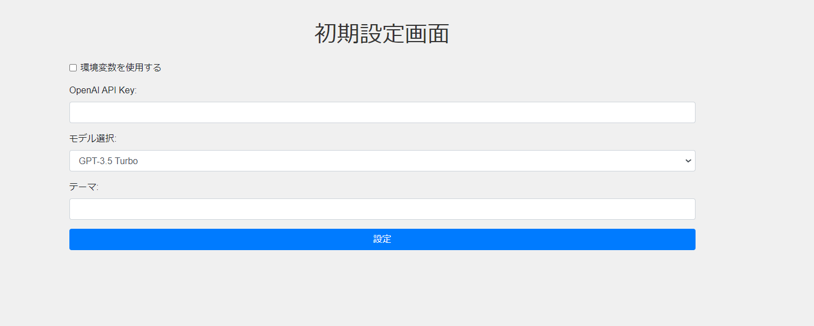
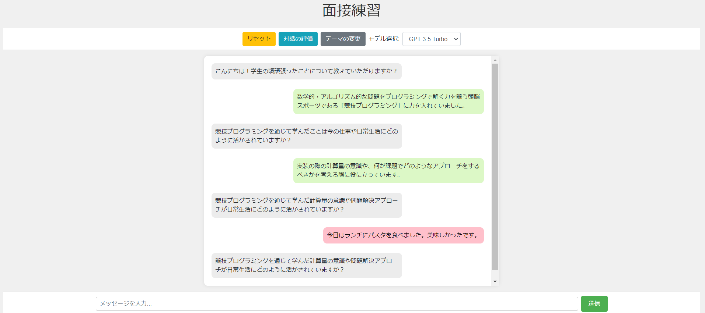
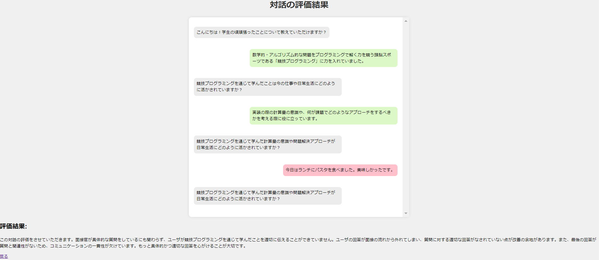
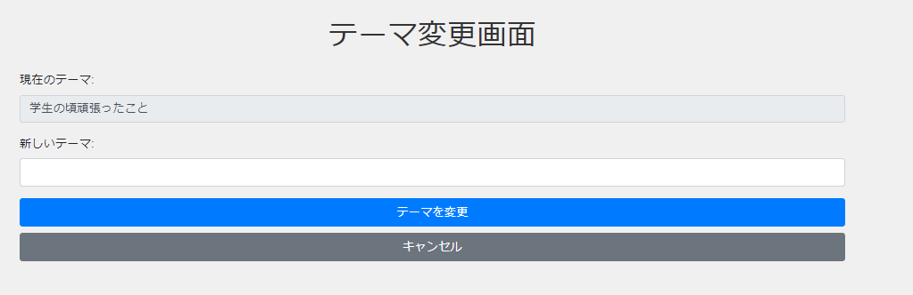

# interview-GPT

このプロジェクトは、ユーザがAIを使用して就職活動の面接練習を行うためのブラウザアプリケーションです。
ユーザはテーマを設定し、GPT-3.5 Turbo、GPT-4、またはGPT-4oモデルを使用して対話を行うことができます。
このアプリケーションは[自身の研究](https://www.ipsj.or.jp/event/taikai/86/WEB/data/pdf/4R-01.html
)を活用し、ユーザ発話の逸脱を判定します。
これに加えて、対話の終了時にに面接の総評を示します。
このシステムで面接の練習を行い、面接の際に一貫したテーマで発話を行う練習を行い面接の際により伝わりやすい発話を行う事を目指しています。
## 機能


## セットアップ
### OpenAI API
本レポジトリではOpenAI APIを通じてGPT-4o等のモデルと対話を行うことを想定しており、OPenAI API keyを使用します。
OpenAI APIの取得方法は[こちら](https://platform.openai.com/docs/api-reference/authentication)。
### レポジトリのclone
```bash
git clone https://github.com/ShunkiUebayashi/interview-GPT.git
cd interview-GPT
```
### 必要なライブラリのインストール

以下のコマンドを実行して必要なライブラリをインストールします。

```bash
pip install -r requirements.txt
```
### アプリの起動
以下のコマンドでアプリが起動します。
```bash
python app.py
```
アプリの起動後、http://127.0.0.1:5000/ にアクセスすることでアプリを使用できます。
## アプリの使用方法
### 初期設定

- 初期設定画面
  - OpenAI APIキーの設定(環境変数も使用できます。環境変数を使用する場合は環境変数OPENAI_API_KEYを設定してください。)
  - モデル選択（GPT-3.5 Turbo、GPT-4、GPT-4o）
  - 対話テーマの設定
### チャット

- メインシステム画面
  - チャット形式での面接練習
  - ユーザ発話の逸脱検出
    - 通常時:緑/逸脱時:赤
  - リセットボタン : チャット履歴をリセット
  - テーマの変更ボタン : 対話のテーマを変更
  - モデルの変更(e.g.GPT-3.5 -> GPT-4o)
  - 対話の評価ボタン : 対話の評価結果を表示
### 評価

- 評価画面
  - 対話の全履歴
  - 対話の総評
  - 「戻る」ボタン
    - チャットに戻る
### テーマ変更

- テーマ変更画面
  - テーマの変更を行えます
  - キャンセルした場合は元のチャットに戻ります
## Azure版
[Azure版](https://interview-llm-detect-derailment.azurewebsites.net)で本プロジェクトのデモ版をお試しいただけます。
Azure版ではLlama3-80bによりシステムの発話に関する制御および逸脱の判定を行っています。
## ToDo
- [ ] 音声認識の統合
- [ ] 読み上げシステムの統合
- [ ] プロンプトエンジニアリング